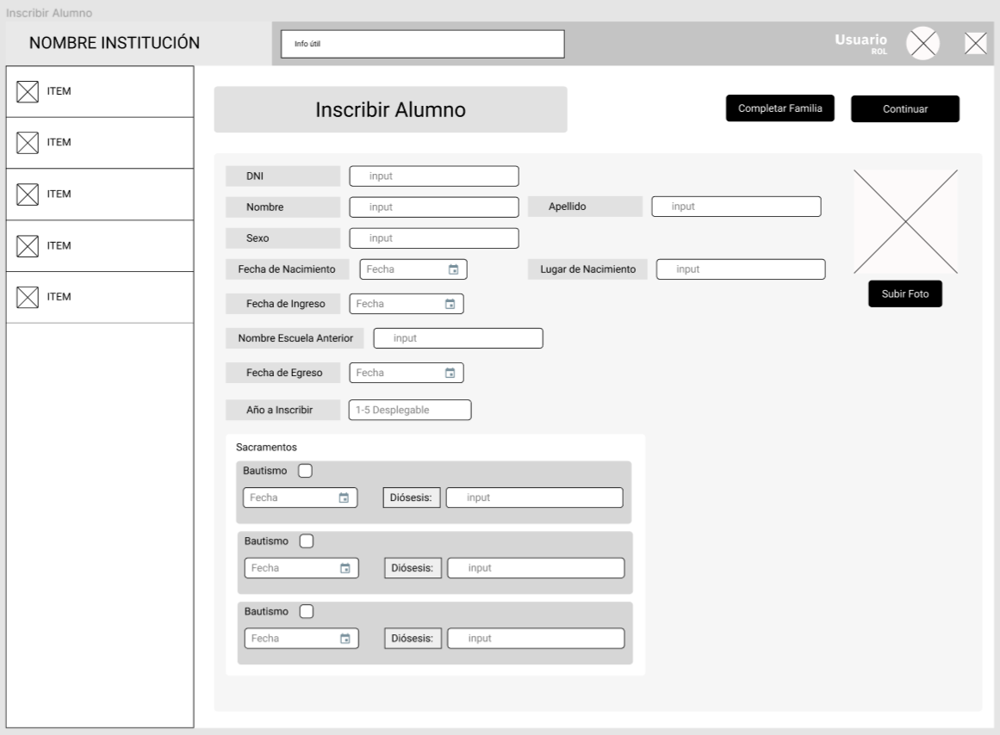
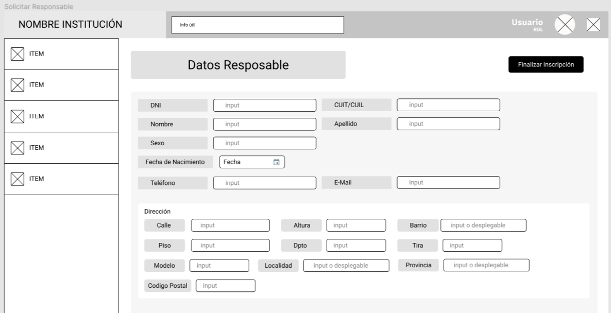
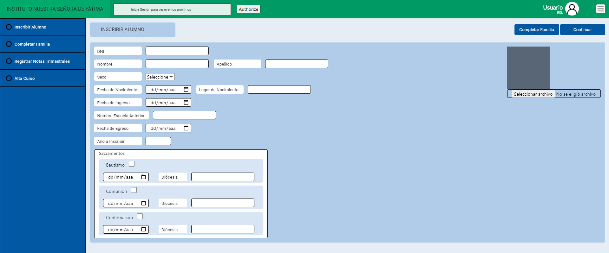
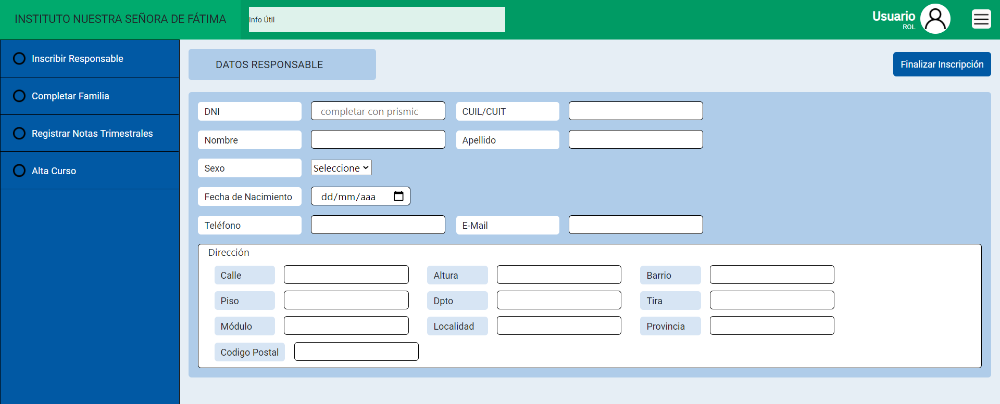

# SGIF - Sistema de Gestión del Instituto de Nuestra Señora de Fátima

En este repositorio se encuentra el trabajo Nº2 de la materia Sistemas de Información para la Web. En el mismo se realiza la implementación de una transacción el sistema (diseñado en materias anteriores) haciendo uso del CSM [Prismic](https://prismic.io/).  

## CSM Elegido

El CMS elegido posee una arquitectura Headless, por lo tanto, el backend y el frontend estan desacoplados. De esta manera el CMS nos proporciona la tecnología de base de datos y la forma de gestionar el contenido. Desde su propia web, se debe crear un repositorio en el que se define por documentos los esquemas de datos (contenido) que se va a tener y la estructura de las páginas; y luego expone una API REST para su acceso. Luego, se debe desarrollar el frontend desde HTML, CSS y JS manualmente o haciendo uso de un framework de frontend como React o Vue, desde donde se debe llamar a la API REST del backend para acceder al contenido. La ventaja que tienen es que el contenido puede ser accedido tanto por una o varias implementaciones del frontend, como por otras aplicaciones que lo requieran.

Elegimos este CMS, porque la gestión del contenido se hace por interfaz gráfica; así es más versátil estructurarlo y no es necesario que, como creadores del contenido, lo programemos en el backend. Por otra parte, al no tener un motor de renderizado de la interfaz, como puede ser uno Tradicional, nos permite desarrollar el mismo diseño desarrollado en una entrega anterior (Ver Figuras 1 y 2) sin restricciones.

## Descripción de la Transacción

La transacción consiste en la inscripción de un alumno a la institución. En la misma se solicitan los datos básicos del alumno y los datos básicos de su responsable; y luego se registran estos datos en el sistema

## Descripción del desarrollo del Frontend.
Para el desarrollo del frontend, si bien se usó un [CMS Headless](#-CSM-Elegido), se decidió realizarlo sin un framework de frontend porque es un desarrollo para una entrega futura. Por lo tanto, se utilizó HTML, CSS, JS y algunos elementos de Bootstrap.

###Distribuición y Colores
En cuanto a la distribución de los elementos, se siguió el modelo desarrollado en una entrega anterior y el mismo se puede observar en las figuras 1 y 2. Lo que se buscó es que la interfaz fuese amigable para el usuario tratando de maximizar la usabilidad del sistema y que su curva de aprendizaje sea baja. De esta manera se mantuvo una distribución típica a un sistema de gestión.

Figura 1. Diseño Inscribir Alumno - Datos básicos Alumno.

Figura 2. Diseño Inscribir Alumno - Datos básicos Responsable.

Respecto a los colores se buscó que estos sean representativos a los del colegio y mantengan la atención sobre los elementos relevantes. Por lo tanto se destacaron los botones y la barra de navegación del sistema. La parte de los formularios se estableció en una tonalidad más clara para que no sobrecargue al usuario, ya que será el lugar donde trabajará más tiempo. Finalmente, la header de la página posee un color distintivo al resto, para que destaque su atención y se entienda que es el área de trabajo principal como si lo es la parte central de la interfaz.

Los diseños resultantes son:

Figura 3. Diseño Final Inscribir Alumno. Datos básicos Alumno.

Figura 4. Diseño Final Inscribir Alumno. Datos básicos Responsable.

## Descripción de las apis elegidas
Respecto a las API elegidas, se elgió [Google Calendar](https://developers.google.com/calendar) para que muestre en el header del sitio cuales son los próximos eventos institucionales que tiene el usuario. Haciendo uso de la API, específicamente del endpoint [list](https://developers.google.com/calendar/v3/reference/events/list) se obtienen todos los eventos y de ellos se extrae su nombre, fecha y hora.

Por otra parte, RobomaticAI. Es una API que consiste de un chatbot, el cual recibe un mensaje y con el uso de inteligencia artificial da una respuesta. Fue agregada al sistema con el objetivo de simular una conversación por chat con algún usuario interno o externo a la institución, dando la posibilidad a esta función en el futuro. La API se puede consumir públicamente, ya sea a través del gestor [RapidAPI](https://rapidapi.com/infradrive-infradrive-default/api/robomatic-ai) o desde la propia página web del bot [RoboMatic AI](https://robomatic.ai).

## Conclusiones

Al implementar una solución con este tipo de herramientas encontramos como en todo ventajas y desventajas. Como ventaja es que tiene componentes por default listos para su uso, que en caso de que se quiera implementar un sistema genérico, y sin mucha identidad de marca, puede ser suficiente. Otra ventaja, al estilo framework, es que provee una base de un proyecto armado, tanto a nivel de frontend como backend para que se pueda empezar a personalizar a partir de ella. Lo bueno que encontramos de prismic, es que esa base se puede generar a partir de distintos lenguajes de programación, lo cual es bastante abierta y no limita en uno o dos lenguajes.

Como contraparte, también tocamos distintos puntos. Como principal desventaja encontramos que no se pueden cargar (POST) datos a través del frontend. Únicamente permite hacerlo desde una interfaz gráfica en su web, o consumiendo una base de datos al estilo import. Esto no estaba especificado en la web y por lo tanto lo detectamos al momento de querer implementar esta funcionalidad, algo que nos pareció bastante informal de parte de prismic. Otra desventaja, es que las páginas que ofrece al iniciar el proyecto base se generan con la extensión “pug”, estas se pueden dividir en componentes al estilo React o Angular pero no son reactivas, por lo que se debe hacer un reload de las páginas por completo y limita el desarrollo, en nuestro caso de un formulario dividido en dos partes.

En general, más allá de utilizar una herramienta de este tipo, es necesario saber programación, diseño y bases de datos, por lo que una persona sin estas capacidades no podría crear un sistema completo a través de la interfaz que provee prismic o cualquier otro CMS (no importa cual sea, se deben tener ciertos conocimientos sobre estos temas).

Haciendo un balance, creemos que es muy limitante para nuestro dominio y seguramente para otros también. Teniendo que tener las capacidades de programación que mencionamos previamente, y con los frameworks disponibles que existen hoy en día, tanto a nivel de backend como frontend se puede hacer un sistema que se ajuste más a las necesidades del negocio con bastante rapidez, por lo menos el tipo de sistema que ofrecen crear este tipo de herramientas.

Finalmente, en cuanto a las APIs encontramos que estas son muy útiles y de fácil uso cuando su documentación está completa y bien especificada. Nos permitieron en un día tener en funcionamiento dos módulos que desarrollarlos por nuestra cuenta serían muy costosos. Si bien, las APIs utilizadas fueron demostrativas, nos dio una buena introducción al potencial que tiene estar al tanto de las mismas y tener en cuenta una posible integración al sistema.
